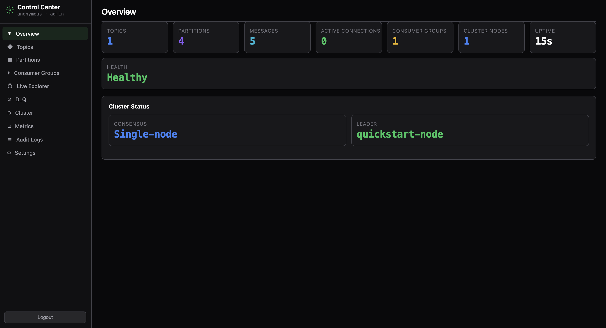

# pubsub-broker

[](https://github.com/Hoot-Code/pubsub-broker) | [English](README.md)

یک بروکر پیام‌رسان pub/sub آماده تولید، خودکفا و نوشته شده با Go خالص با صفر وابستگی خارجی. این بروکر موضوعات پارتیشن‌بندی شده، تحویل دقیقاً یک‌بار (exactly-once)، خوشه‌بندی چندگرهی داخلی، متریک‌های سازگار با Prometheus و ردیابی سازگار با OpenTelemetry را ارائه می‌دهد — همه از یک باینری کامپایل شده ایستا که می‌توانید آن را در هر محیطی بدون زمان اجرا قرار دهید.

## ویژگی‌ها

- **موضوعات پارتیشن‌بندی شده** — پیام‌ها به صورت قطعی (FNV-1a key hash) یا round-robin در شمارش پارتیشن‌های قابل پیکربندی توزیع می‌شوند
- **گروه‌های مصرف‌کننده** — مصرف‌کننده‌های مستقل چندگانه offsetهای تایید شده را در هر پارتیشن ردیابی می‌کنند؛ پشتیبانی از جستجو بر اساس offset و timestamp
- **تحویل Push** — فریم‌های `CmdPush` فعال شده توسط سرور polling را حذف می‌کنند؛ مشترکان یک‌بار اشتراک می‌شوند و پیام‌ها را هنگام رسیدن دریافت می‌کنند
- **دوام بر پایه WAL** — هر انتشار قبل از نوشتن segment در Write-Ahead Log ثبت می‌شود؛ بروکر در صورت کrash سیستم‌عامل بدون از دست دادن پیام باقی می‌ماند
- **تکثیر ISR** — ردیابی In-Sync Replica با نوشتن quorum؛ یک follower که عقب می‌افتد به طور خودکار از مجموعه ISR حذف می‌شود
- **انتخاب رهبر Bully** — انتخاب رهبر با دور واحد با تشخیص خرابی بر پایه heartbeat (محدودیت‌ها را در ARCHITECTURE.md ببینید)
- **TLS** — TLS 1.3 در هر دو پورت پروتکل باینری و پورت HTTP admin
- **فشرده‌سازی پیام** — کدک flate/zlib برای هر پیام در زمان انتشار مذاکره می‌شود، شفاف برای مصرف‌کنندگان
- **جستجو بر اساس timestamp** — اسکن جستجوی باینری offset اولی را پیدا می‌کند که timestamp رکورد آن ≥ مقدار نانوثانیه داده شده باشد
- **تخلیه graceful** — `Stop()` منتظر تکمیل تمام درخواست‌های در حال پردازش قبل از خراب کردن اتصالات می‌ماند

## مقایسه

| ویژگی                    | pubsub-broker  | NSQ        | NATS core         |
|--------------------------|----------------|------------|-------------------|
| پایداری                  | ✅ WAL + segment | ✅ disk    | ❌ فقط حافظه     |
| پارتیشن‌ها              | ✅              | ❌         | ❌ (فقط JetStream)|
| گروه‌های مصرف‌کننده     | ✅              | ✅ channel | ❌                |
| خوشه‌بندی               | ✅ Bully + ISR  | ✅         | ✅                |
| تحویل دقیقاً یک‌بار     | ✅ SeqNum dedup | ❌         | ❌                |
| تحویل Push              | ✅              | ✅         | ✅                |
| فشرده‌سازی              | ✅ flate / zlib | ✅         | ✅                |
| باینری صفر-وابسته       | ✅              | ✅         | ✅                |

## شروع سریع (Docker)

> **نکته در مورد پارتیشن‌ها:** پیام‌ها با هش کردن کلید پیام (یا round-robin در صورت عدم وجود کلید) به پارتیشن‌ها مسیریابی می‌شوند. یک پیام با کلید `"order-1"` همیشه در همان پارتیشن قرار می‌گیرد، اما لزوماً پارتیشن 0 نیست. از `brokectl tail --topic <t>` (بدون پرچم `--partition`) برای اسکن همه پارتیشن‌ها استفاده کنید — فرض نکنید که پارتیشن 0 است.

```bash
docker-compose up -d
brokectl --addr 127.0.0.1:9000 topic create --name orders --partitions 4
brokectl --addr 127.0.0.1:9000 publish --topic orders --key order-1 --payload '{"id":1,"amount":99.00}'
brokectl --addr 127.0.0.1:9000 consumer list
brokectl --addr 127.0.0.1:9000 tail --topic orders --count 5
brokectl --addr 127.0.0.1:9000 health
```

`tail` به طور پیش‌فرض همه پارتیشن‌ها را اسکن می‌کند، زیرا پیام‌ها بر اساس هش کلید توزیع می‌شوند — نیازی نیست بدانید پیام در کدام پارتیشن قرار گرفته است.

## نصب یک‌کلیک

برای شروع سریع بدون نیاز به Docker، اسکریپت quickstart را اجرا کنید:

```bash
curl -fsSL https://raw.githubusercontent.com/Hoot-Code/pubsub-broker/main/quickstart.sh | bash
```

یا اگر مخزن را کلون کرده‌اید:

```bash
chmod +x quickstart.sh && ./quickstart.sh
```

این اسکریپت بروکر و brokectl را بیلد کرده، یک موضوع نمونه ایجاد کرده و 5 پیام منتشر می‌کند. با Ctrl-C بروکر متوقف می‌شود.

## شروع سریع (Go SDK)

```go
package main

import (
    "context"
    "fmt"
    "log"
    "time"

    "github.com/Hoot-Code/pubsub-broker/pkg/client"
)

func main() {
    // اتصال به بروکر — بدون نیاز به وابستگی‌های خارجی.
    c, err := client.Dial("127.0.0.1:9000",
        client.WithDialTimeout(10*time.Second),
        client.WithReadTimeout(30*time.Second),
    )
    if err != nil {
        log.Fatalf("dial: %v", err)
    }
    defer c.Close()

    // احراز هویت (اگر auth در پیکربندی بروکر غیرفعال است حذف کنید).
    if err := c.Authenticate("my-api-key"); err != nil {
        log.Fatalf("auth: %v", err)
    }

    ctx := context.Background()

    // انتشار پیام و دریافت offset اختصاص داده شده.
    prod := c.NewProducer("orders")
    offset, err := prod.Publish(ctx, "key-1", []byte(`{"amount":99}`), nil)
    if err != nil {
        log.Fatalf("publish: %v", err)
    }
    fmt.Printf("published at offset %d\n", offset)

    // ایجاد مصرف‌کننده در گروه با نام و دریافت بر اساس Push.
    // پیام‌ها بر اساس هش کلید در پارتیشن‌ها توزیع می‌شوند، بنابراین
    // پارتیشن مشخص نمی‌کنیم — گروه مصرف‌کننده از همه پارتیشن‌ها دریافت می‌کند.
    cons := c.NewConsumer("my-group", "orders")
    if err := cons.Subscribe(ctx); err != nil {
        log.Fatalf("subscribe: %v", err)
    }
    for msg := range cons.Messages() {
        fmt.Printf("partition=%d offset=%d payload=%s\n", msg.Partition, msg.Offset, msg.Payload)
        // تایید offset تا گروه از این پیام عبور کند.
        _ = cons.Commit(ctx, msg.Partition, msg.Offset)
    }
}
```

## شروع سریع (HTTP Gateway)

برای مرورگرها یا زبان‌هایی بدون SDK بومی، دروازه اختیاری HTTP/WebSocket را فعال کنید (`"gateway": {"enabled": true, "addr": ":8080"}` در `broker.json`، یا `go run ./cmd/gateway -broker-addr 127.0.0.1:9000 -addr :8080` را به عنوان فرآیند جداگانه اجرا کنید) و از `curl` ساده استفاده کنید:

```bash
# ایجاد موضوع
curl -s -X POST http://127.0.0.1:8080/v1/topics \
     -d '{"name":"orders","partitions":4}'

# انتشار پیام
curl -s -X POST http://127.0.0.1:8080/v1/topics/orders/messages \
     -d '{"key":"order-1","payload":"hello"}'

# دریافت از یک پارتیشن خاص (API REST مخصوص پارتیشن است —
# کلید "order-1" بر اساس هش به یک پارتیشن خاص می‌رود، لزوماً 0 نیست.
# از brokectl tail --topic orders (بدون پرچم --partition) برای اسکن همه استفاده کنید.)
curl -s 'http://127.0.0.1:8080/v1/topics/orders/partitions/0/messages?offset=0&limit=10'
```

برای اشتراک‌گذاری از طریق WebSocket، پروژه دارای صفر وابستگی است بنابراین هیچ کلاینت JS/Python WS ارائه نشده — از هر ابزار سازگار با RFC 6455 استفاده کنید، مثلاً [`websocat`](https://github.com/vi/websocat):

```bash
websocat "ws://127.0.0.1:8080/v1/topics/orders/stream?group=my-group&consumer=c1"
```

...یا این قطعه کد پایتون حداقلی و بدون وابستگی با استفاده از کتابخانه استاندارد `socket`/`hashlib`/`base64` (بدون نیاز به پکیج `websockets`، سازگار با سیاست صفر-وابستگی پروژه):

```python
import socket, base64, hashlib, os

key = base64.b64encode(os.urandom(16)).decode()
sock = socket.create_connection(("127.0.0.1", 8080))
sock.send((
    "GET /v1/topics/orders/stream?group=my-group HTTP/1.1\r\n"
    "Host: 127.0.0.1:8080\r\nUpgrade: websocket\r\nConnection: Upgrade\r\n"
    f"Sec-WebSocket-Key: {key}\r\nSec-WebSocket-Version: 13\r\n\r\n"
).encode())
print(sock.recv(4096))  # 101 Switching Protocols + first frames arrive here
```

## پیکربندی

یک فایل پیکربندی پیش‌فرض با ابزار داخلی تولید کنید:

```bash
go run ./cmd/gen-config > broker.json
```

برای استقرار Kubernetes به `deploy/k8s/` مراجعه کنید — شامل StatefulSet، ConfigMap، Service و PodDisruptionBudget.

## معماری

برکر یک سرور TCP باینری، یک لاگ segment فقط-افزایشی، یک Write-Ahead Log، ردیابی offset گروه مصرف‌کننده، عضویت خوشه اختیاری و یک سرور HTTP admin را در یک ارکستریتور `Broker` یکپارچه می‌کند. برای نمودار کامل، مرجع دستورات پروتکل و بررسی عمیق موتور ذخیره‌سازی به [ARCHITECTURE.md](ARCHITECTURE.md) مراجعه کنید.

## داشبورد

بروکر شامل یک مرکز کنترل عملیاتی (Operational Control Center) تعبیه شده در `GET /dashboard` (یا `GET /` که به آنجا هدایت می‌شود) است. داشبورد یک برنامه تک‌صفحه‌ای چندفایلی (ES modules، بدون نیاز به build) با تم تاریک و فونت‌های سیستم است. هیچ منبع CDN خارجی بارگذاری نمی‌شود.

### بخش‌ها

- **Overview** — تعداد موضوعات/پارتیشن‌ها، اتصالات فعال، گروه‌های مصرف‌کننده، وضعیت خوشه، نشان سلامت، زمان کارکرد
- **Topics** — لیست موضوعات با تعداد پارتیشن، تعداد پیام، اندازه ذخیره‌سازی، سیاست نگهداری و تعداد گروه‌های مصرف‌کننده
- **Partitions** — جزئیات هر پارتیشن (رهبر، تکثیرها، ISR، وضعیت WAL، نشان under-replicated، اطلاعات segment)
- **Consumer Groups** — جفت‌های گروه+موضوع قابل گسترش با نمایش اعضا، وضعیت rebalancing، offset تایید/فعلی و lag هر پارتیشن
- **Live Explorer** — دم زنده پیام‌ها از طریق WebSocket با فیلترهای موضوع/پارتیشن/کلید/تولیدکننده/محتوا، توقف/ادامه، محدودیت 500 پیام در DOM
- **DLQ** — مرورگر dead-letter queue با بازپخش، حذف، خروجی و پاکسازی انبوه (فقط ادمین)
- **Cluster** — کارت‌های گره، تصویرسازی رهبر/follower، جزئیات Raft (دور، commit index، match/next index همتا)، جدول ISR
- **Metrics** — نمودارهای بازه زمانی (5m/15m/1h/24h) برای نرخ انتشار/مصرف، اتصالات، حافظه، CPU، WAL throughput، consumer lag
- **Audit Logs** — 100 رویداد آخر با جستجوی سمت کلاینت بر اساس کلاینت، نوع یا موضوع
- **Settings** — نمایش فقط-خواندنی پیکربندی مؤثر

داشبورد نیاز به احراز هویت دارد وقتی `auth.enabled` فعال باشد (از طریق `network.dashboard_auth_enabled` قابل پیکربندی). محدودیت‌های RBAC در سمت کلاینت برای تجربه کاربری اعمال می‌شود؛ تمام امنیت در سمت سرور اجرا می‌شود.



## مجوز

MIT — به `LICENSE` مراجعه کنید.
